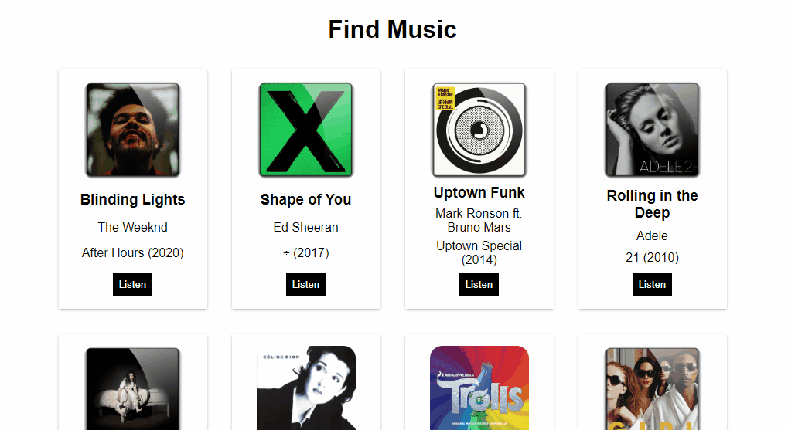

# Find music



## About

This is a simple music listing app.

## Run

Install json-server to fake an API:

```
npm install -g json-server
```

then run:

```
json-server --watch ./assets/db/data.json
```

After that, you need to install [Live Server extension](https://marketplace.visualstudio.com/items?itemName=ritwickdey.LiveServer), right click on `index.html` file and then click on `Open with Live Server`.
